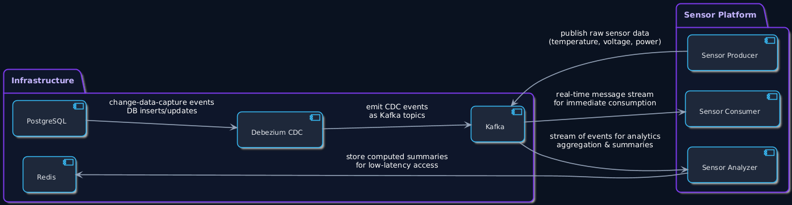
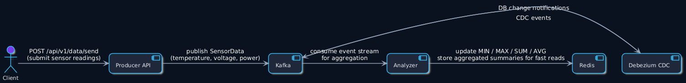
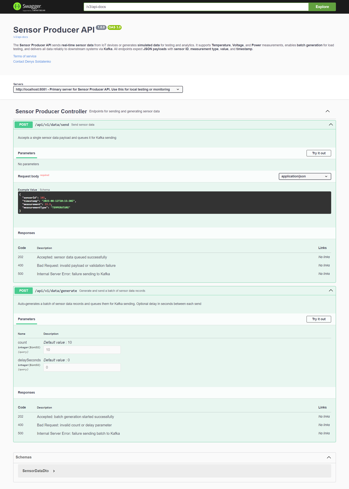
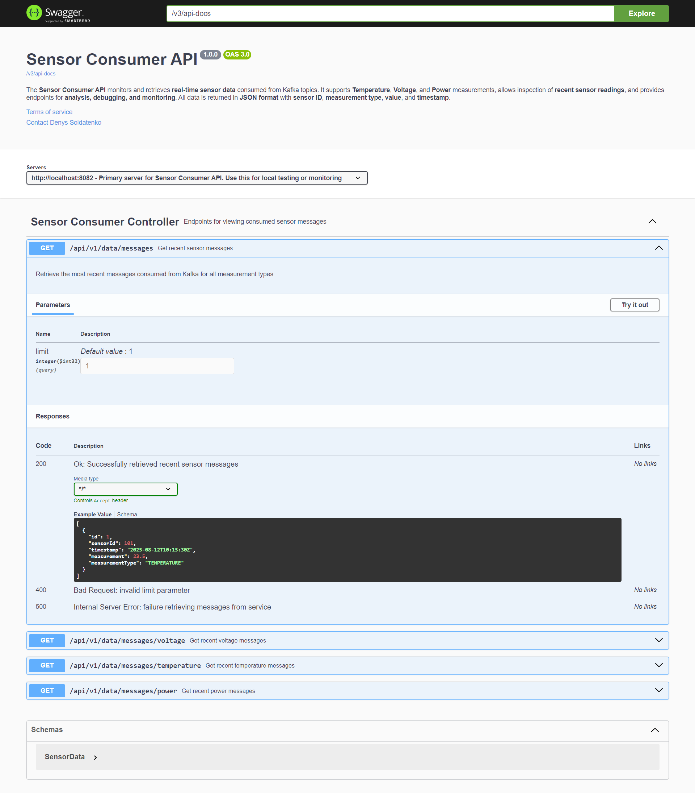
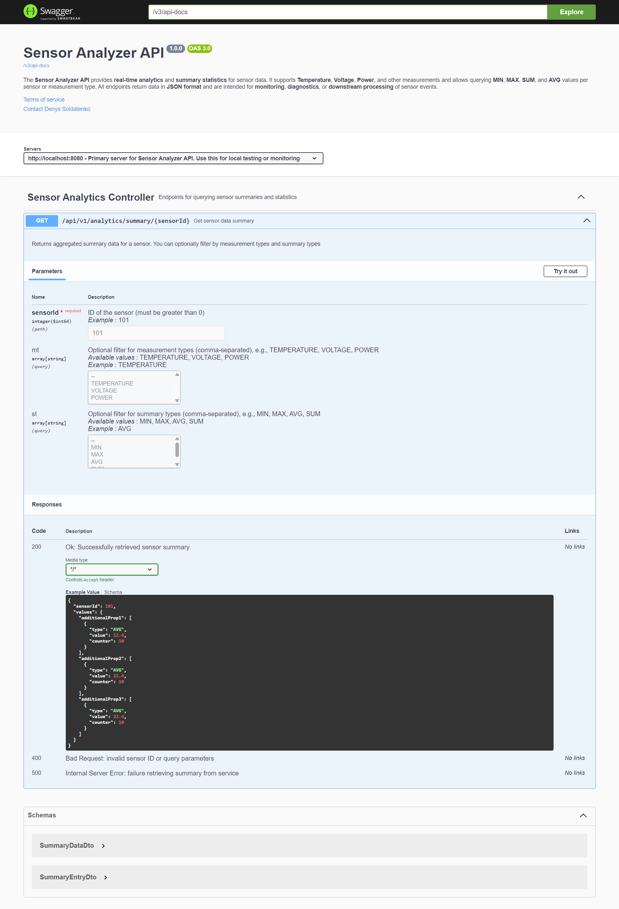
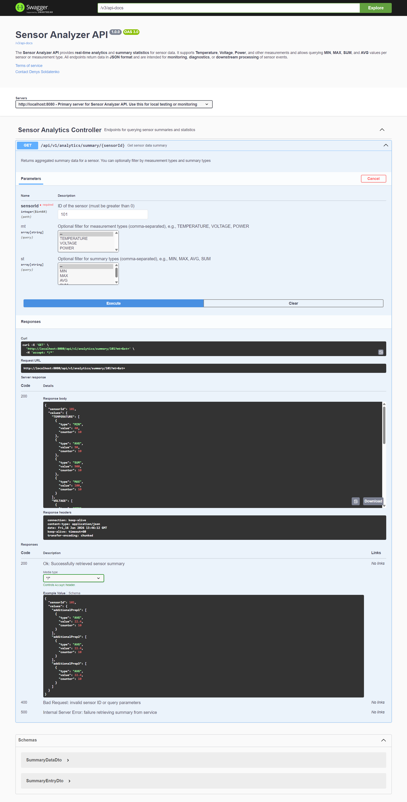

# 🌡️ SensorMicro_project

A **production-ready, event-driven sensor data pipeline** for **real-time ingestion, storage, and analytics** using **Debezium, Redis, and PostgreSQL**.

This microservices project provides a complete system for **IoT or industrial sensor monitoring**, supporting **streaming, aggregation, and REST APIs** for analytics.

---

## 🌟 Overview

**SensorMicro_project** is designed for **high-performance, real-time sensor pipelines**.

**Purpose & Features:**

- Collect sensor events via REST or batch generation
- Capture **database changes in real-time** using Debezium CDC from PostgreSQL
- Aggregate sensor measurements into **MIN, MAX, AVG, SUM**
- Store fast-access summaries in **Redis**
- Expose REST APIs for both **raw messages** and **analytics summaries**

Ideal for **IoT applications, smart factories, or experimental research platforms** requiring low-latency metrics.

---

## 🏗️ System Architecture

High-level architecture showing **data flow between services and storage**:

  
*Description: Flow from sensor data ingestion → PostgreSQL → Debezium → Kafka → Consumer/Analyzer → Redis/API.*

  
*Description: Step-by-step sensor data processing and analytics pipeline.*

## 🛠️ Microservices Overview

### 1️⃣ Sensor Producer 📝
Handles **sensor data ingestion**.

**Key Features:**

- Accept manual sensor input via REST
- Generate **randomized batches** for testing
- Insert data into **PostgreSQL**, triggering Debezium CDC events

---

### 2️⃣ Sensor Consumer 👁️
Consumes Kafka messages and exposes **recent sensor readings** via REST.

**Key Features:**

- Retrieve **last N sensor messages**
- Filter messages by **measurement type**: TEMPERATURE, VOLTAGE, POWER
- Lightweight, stateless service

---

### 3️⃣ Sensor Analyzer 📊
Aggregates sensor measurements into **analytics summaries** stored in Redis.

**Key Features:**

- Supports aggregation types: **MIN, MAX, AVG, SUM**
- Filter by measurement type and summary type
- Fast REST endpoints for real-time analytics

---

## 📡 API Endpoints

### **Sensor Producer API** – Send or generate sensor data

### **Sensor Consumer API** – Retrieve recent sensor messages

### **Sensor Analyzer API** – Get aggregated summaries

## 📊 Analytics Examples

Example output of `/analytics/summary/{sensorId}`:

- Shows **aggregated MIN, MAX, AVG, SUM** per measurement type
- Includes **measurement count** for each metric, providing reliability indicators

---

## 💡 Developer Tips & Best Practices

- **Kafka:** Use partitions wisely to scale consumers efficiently.
- **Redis:** Consider TTLs for temporary summaries if needed.
- **PostgreSQL:** Keep schema consistent for smooth Debezium CDC operations.
- **Payload Validation:** Ensure sensor data is validated to maintain integrity.
- **Batch Inserts:** Use batch inserts for testing large datasets to avoid overhead.
- **Enums:** Prefer Enum types for measurement and summary types to avoid runtime errors.
- **Logging:** Use structured logging in services for easier debugging and monitoring.
- **Error Handling:** Handle Kafka/Redis/Postgres errors gracefully to maintain pipeline reliability.
